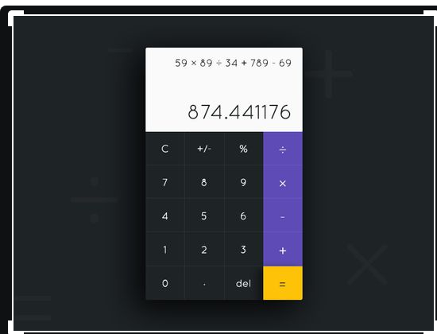

# React Calculator
## React Calculator is a app this help perform simple arithemetic calculation
## This app is a certification project for Free-code-camp

This is a list of tools and libary i used.
- React
- React-DOM
- Babel
- Scss

Design inspiration [here:](https://dribbble.com/shots/3157278-Calculator-App-Design) 